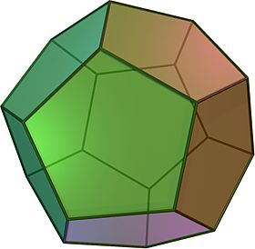

# A2 3d Figures

Assignment No 2 for the computer graphics course. Modify previous code examples to render the following:

- A 3D pyramid with a pentagon base as in Figure 1. The pyramid has to rotate around the axis [0.1, 1.0, 0.2].
- A [Dodecahedron](https://en.wikipedia.org/wiki/Regular_dodecahedron), as in Figure 2. It has to rotate around the axis [-0.4, 1.0, 0.1], and around the axis [0.0, 1.0, 0,0].
- An Octahedron, as in Figure 3. It has to rotate around the axis [0, 1, 0]; it also has to move up and down within the canvas: it moves up until it reaches the top of the canvas, then it moves down until it reaches the bottom, and then it repeats.

**Rubric:**

1. The canvas was adjusted to include the 3 figures. The pyramid at the left of the canvas, the dodecahedron at the center, and the octahedron at the right.
2. Created an independent function for each figure.
3. Defined the vertex, color, and index information for each figure.
4. Each face of each figure was rendered with a different color.
5. The figures were transformed correctly.

**Deadline: 01/02/2019 1:00pm**

 Figure 1: 3D Pyramid. 

 Figure 2: 3D Dodecahedron. 

 Figure 3: 3D Octahedron.
