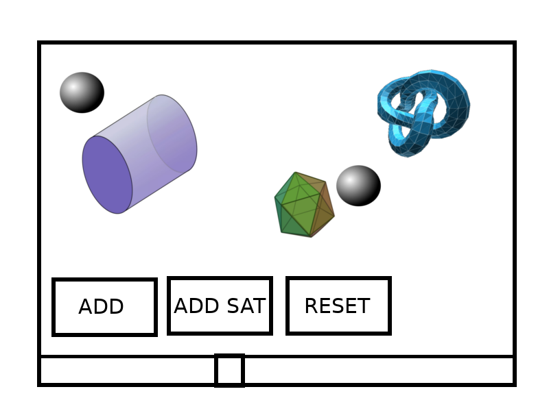

# A3 Basic UI

Assignment No 3 for the computer graphics course. Modify previous code examples to render the following:

 Figure 1: Basic 3d UI. 

- The page has to have a canvas where the Three.js scene is rendered.
- A slider on the bottom of the page controls the scale of all the 3d objects in the scene.
- The 'ADD' button, adds one figure, with a random position within the scene, from 4 figures of your choosing. Each time the add button is clicked, a different figure is added in order. For example: if you select a cylinder, an icosaedron, and a torus knot, the order in which the figures are added is cylinder, then icosaedron, and finally torus knot. 
- Search the three.js [documentation](https://threejs.org/docs/index.html) for some of the available geometries.
- You can keep pressing the button and adding figures in order.
- The 'ADD SAT' button, adds a sphere that rotates around one of the figures. Each time you press the button, the sphere is added in the same order in which the figures were added.
- The spheres have to rotate around the figures.
- The reset button removes all objects from the scene. **Note** Do not refresh the page when clicking this button.

**Rubric:**

1. The UI was created as instructed.
2. Buttons have the correct behaviour.
3. The figures are added correctly in the scene, and can be visualized from the viewport.
4. Spheres rotate correctly around the figures.
