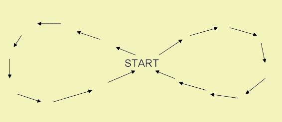

# A5 penguin-wobbling

Assignment No 5 for the computer graphics course. Using three.js, make a penguin walk using keyframes. Use the included OBJ file to load the penguin into a scene. The penguin must also be correctly facing the direction it is walking towards. Consider that penguins walk with a wobbling gait: they walk unsteadily balancing from side to side with every step they take.

 

The penguin has to move in an *8* pattern while walking.

**Rubric:**

- Create a scene with lighting, and shadows. Add an orbit controller to control de scene.
- The canvas must cover the whole window.
- Load the OBJ file into the scene.
- The penguin must start and end at the center of the 8 pattern.
- Define the keyframes needed for the penguin to walk in an 8 pattern.
- Define the keyframes needed for the penguin to balance from side to side while walking.
- Define the keyframes needed for the penguin to face in the correct direction.
- The animation must last at least 10 seconds.

**Extra:**
1. Add keyframes for the lights or the camera.
2. Add additional objects with their own animations.

**Deadline:** 24/04/2020